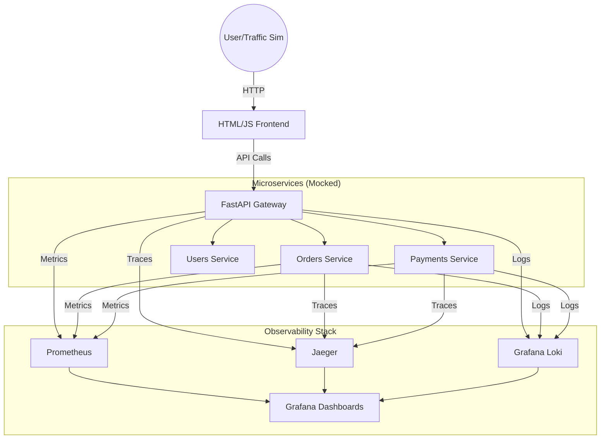

# SRE Observability Platform

A production-grade laboratory designed to demonstrate end-to-end Site Reliability Engineering (SRE) practices, focused on deep observability, system resilience, and incident response.

## 🚀 Project Overview

This platform simulates a microservices environment (Orders, Payments, Users) using FastAPI. It incorporates a full observability stack to monitor Service Level Indicators (SLIs), manage Error Budgets, and perform Chaos Engineering experiments.

## 🏗 Architecture

The system follows a modern distributed architecture using OpenTelemetry for vendor-neutral instrumentation.



## 🛠 Tech Stack

- **Backend:** Python 3.11 (FastAPI)
- **Runtime:** Docker / Docker Compose (Debian-based images)
- **Instrumentation:** OpenTelemetry (OTel)
- **Metrics:** Prometheus
- **Dashboards:** Grafana
- **Tracing:** Jaeger
- **Logging:** Grafana Loki
- **Chaos:** Custom Python scripts for failure injection

## 📊 SRE Indicators (SLOs)

We target the following objectives:

- **Availability:** 99.5% successful requests.
- **Latency:** 90% of requests under 300ms (P90).
- **Error Budget:** Monthly tracking of service degradation.

## 🚦 How to Run (Initial Stage)

_Note: Infrastructure is being provisioned._

1. Clone the repository.
2. Ensure Docker and Docker Compose are installed.
3. Build the core API:
   ```bash
   docker compose up --build -d
   ```

---

_Mentored Project for SRE Portfolio._

## 🔴 Current Lab State: Intentional Failure Simulation

This repository is currently configured in **Chaos Mode** to demonstrate the full observability cycle.

- **Service:** `sre-api`
- **Endpoint:** `/orders`
- **Simulated Condition:** 20% Error Rate (HTTP 500) and High Latency (up to 1s).
- **Objective:** Allow users to observe the transition of Prometheus alerts from `Pending` to `Firing`, visualize error spikes in Grafana, and perform root cause analysis using Jaeger traces.

### How to observe the incident:

1. Run the load generator: `python3 chaos/load_gen.py`.
2. Access **Prometheus Alerts** (`localhost:9090/alerts`) to see `HighErrorRateOrders` in action.
3. Access **Grafana** (`localhost:3000`) to see the "Golden Signals" degrading.
4. Access **Jaeger** (`localhost:16686`) to inspect individual failed spans.
